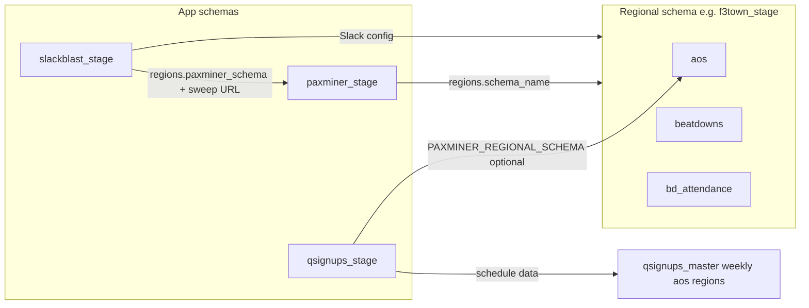

# Architecture

## Monorepo layout

| Path | Purpose |
|------|---------|
| `PAXminer/` | Docker-packaged Lambdas: sync, charts, achievements, Kotter (`/config-paxminer`, `/kotter-report`) |
| `slackblast/` | Zip Lambda + Function URL; Bolt app |
| `qsignups/` | Zip Lambda + Function URL; Bolt app; schedule extension |
| `common/` | Shared `encryption.py`, `token_bootstrap.py` (PAXminer image uses `PAXminer/common/`) |
| `migration/` | One-off migration scripts and env templates |
| `infra/` | Bootstrap CloudFormation (OIDC, SAM artifact bucket) |

Apps do **not** import each other’s Python packages; integration is via **shared MySQL schemas** and env-driven schema names.

## Runtime shapes

- **PAXminer:** Container images, EventBridge schedules, Function URLs for Kotter/interactive and achievements sweep.
- **slackblast / qsignups:** Zip Lambdas, **Lambda Function URLs**, Bolt with `process_before_response` and **lazy listeners** (self `lambda:InvokeFunction`).

## Database and schemas

- **Per-app schemas** (suffix `_test` / `_prod`): `paxminer_*`, `slackblast_*`, `qsignups_*`. Legacy `weaselbot_*` is retired after migration.
- **Per-region schemas** (PAXminer “regional” data): e.g. `f3ttown_prod` — tables such as `aos`, `beatdowns`, `bd_attendance`, `users`.
- **Registry:** `paxminer_<stage>.regions` lists regions and points at regional schema names and encrypted Slack tokens.

### Relational overview (conceptual)

### QSignups (app schema)

- **`qsignups_aos`**, **`qsignups_weekly`**, **`qsignups_master`**, **`qsignups_regions`**, **`qsignups_features`**
- **Views:** `vw_master_events`, `vw_weekly_events`, `vw_aos_sort`
- **OAuth (Bolt):** `slack_bots`, `slack_installations`, `slack_oauth_states` in the same schema as the app

### slackblast

- Uses **regional** schema for `beatdowns` / `bd_attendance` (ORM `Backblast` / `Attendance`) plus app schema for config, Strava tokens, etc.

### Encryption

**`DB_ENCRYPTION_KEY`** (min 16 chars, shared per environment) is stretched (PBKDF2) and used with Fernet-style field encryption (`common/encryption.py` and app-specific copies). Migration and deploy **must** use the same key for a stage.

## QSignups permission model

Resolved in code via [`qsignups/qsignups/permissions.py`](../qsignups/qsignups/permissions.py) using:

- Slack **`users.info`**: `is_admin`, `is_owner`, `is_primary_owner` → **ADMIN**
- Regional **`aos.site_q_user_id`** (requires **`PAXMINER_REGIONAL_SCHEMA`**) → **AOQ** (Site Q / AOQ)
- Regional **`beatdowns.q_user_id`** (any row) → **Q** (has Q’d a beatdown as primary Q)
- Else → **USER**

| Level | Home tab | Manage Region Calendar | General Settings | AO add/delete | Edit AO / events | Edit any Q slot |
|-------|----------|------------------------|------------------|---------------|------------------|-----------------|
| ADMIN | Refresh + Manage + Settings | Full | Yes | Yes | All AOs | Yes |
| AOQ | Refresh + Manage | Subset (no add/delete AO) | No | No | Own AO(s) only | Yes |
| Q | Refresh only | No | No | No | No | Yes |
| USER | Refresh only | No | No | No | No | Own slot only |

If **`PAXMINER_REGIONAL_SCHEMA`** is unset, AOQ and **Q** cannot be detected; behavior falls back to **ADMIN vs USER** (Slack role only) for calendar access.

## Cross-links

- Deploy and env: **[DEPLOY.md](DEPLOY.md)**
- End users: **[USER_GUIDE.md](USER_GUIDE.md)**
