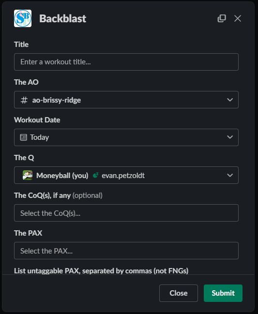

# Slackblast

Slack app for **backblasts**, **preblasts**, optional **Strava** linking, email-to-post, custom fields, and FNG welcome flows. It uses the same shared database as PAXminer (per-region schemas plus a central `slackblast` schema).

Built from **[slack-stack](../README.md)**. Deploy with `slackblast/template.yaml`, `./deploy.sh`, or GitHub Actions — see the root README for secrets, **`DB_ENCRYPTION_KEY`**, **`IMAGE_S3_BUCKET`**, and migration notes.

## Getting started (production)

1. Deploy the stack; open the **`SlackblastApi`** output URL and use the **`/slack/install`** path to OAuth into your workspace.
2. Ensure PAXminer (or equivalent) is populated for your region if you rely on shared AO/user data.
3. Upload static images to your image bucket once (Strava buttons, powered-by logo): files under [slackblast/assets/](assets/) → `aws s3 cp slackblast/assets/ s3://YOUR_BUCKET/ --recursive` (bucket name = `IMAGE_S3_BUCKET`).

## Features

- **`/slackblast`**, **`/backblast`**, **`/preblast`** — Modal forms for structured posts.
- **`/config-slackblast`** — Region settings (email, Strava, custom fields, edit locks, templates).
- **Strava** — Optional connect flow and activity pickers (tokens encrypted with `DB_ENCRYPTION_KEY`).
- **Custom fields** — Extra JSON stored on backblast rows for reporting.
- **Email / Postie** — Optional SMTP + post-by-email configuration.
- **Welcome messages** — **`/config-welcome-message`** for DMs and channel intros.



## Local development

Prerequisites: Python **3.12**, MySQL (or compatible), [ngrok](https://ngrok.com/) (or similar) for Slack callbacks.

```bash
cd slackblast   # directory that contains template.yaml and the slackblast/ package
python3.12 -m venv .venv && source .venv/bin/activate
pip install -r slackblast/requirements.txt
# Optional: poetry install if you maintain dependencies via Poetry
```

1. Copy [.env.example](.env.example) to **`.env`** in this same directory and set `SLACK_*`, `ADMIN_DATABASE_*`, **`IMAGE_S3_BUCKET`** (required for image URLs and uploads), `PAXMINER_SCHEMA`, etc.
2. Create a **Slack app** from **[manifest.json](manifest.json)**. For local dev, replace every `__HOSTNAME__` with your ngrok **base URL** (e.g. `https://abc.ngrok-free.app`, no path). For AWS, run **`./deploy.sh`** from the repo root and use the generated **`slackblast/manifest-{test|prod}.json`** (gitignored), which already contains your API Gateway base URL.

3. Initialize a local DB: from this directory (`template.yaml` here), run  
   `set -a && source .env && set +a && python slackblast/utilities/database/create_clear_local_db.py`  
   (or run the SQL in `slackblast/utilities/database/create_clear_local_db.sql` manually).
4. `ngrok http 3000`, paste the forwarding URL into the Slack app URLs, then run the app from the **inner** package dir, e.g.  
   `cd slackblast && set -a && source ../.env && set +a && python app.py`  
   (or nodemon/poetry per your setup).

If you add Python packages, keep **`slackblast/requirements.txt`** in sync with what SAM builds (e.g. `poetry export` if using Poetry).

## Contributing

Use your team’s issue tracker and PR process for this monorepo fork.

[](https://github.com/psf/black)
