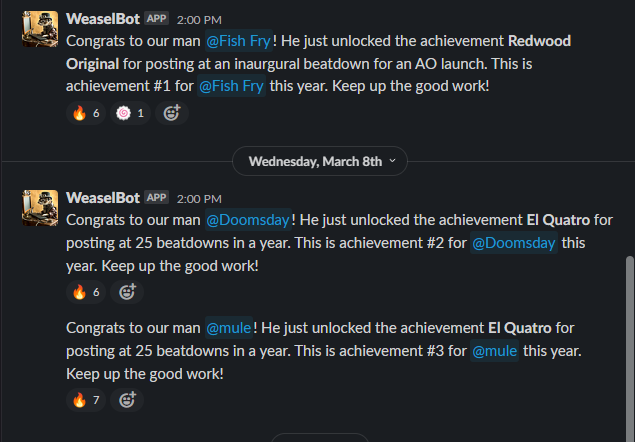
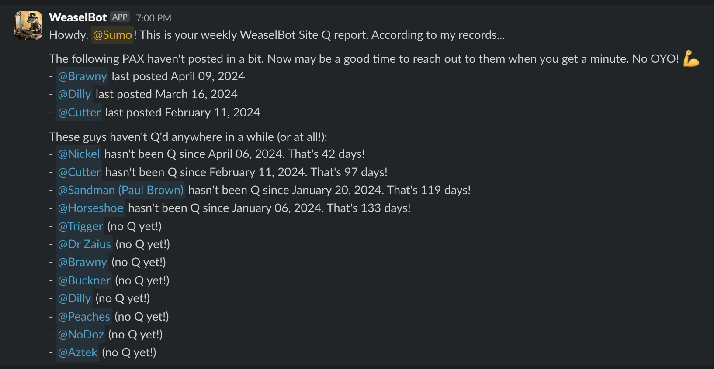

# Weaselbot

Supplemental Slack automation that sits on top of PAXminer data: **achievements** and **Kotter**-style inactivity reports.

This app lives in the **[slack-stack](../README.md)** monorepo. It is deployed as **container-image** Lambdas (`weaselbot/template.yaml`). See the root README for `sam build`, `./deploy.sh`, GitHub Actions, and `DB_ENCRYPTION_KEY`.

## Features

- **Achievements** — Threshold-based shout-outs when PAX hit activity milestones (configurable per region via DB tables).
- **Kotter reports** — Weekly summaries for site leads based on posting patterns and “home region” logic (tiers configurable via `HOME_REGION_DATE_TIERS` / SAM).





## Slack app manifest

Create an app at [api.slack.com/apps](https://api.slack.com/apps/) from **[manifest.json](manifest.json)** (JSON), then install to your workspace and store the **bot token** securely (database + encryption as per root README). Weaselbot has no HTTP endpoints in SAM; the manifest has no request URLs. After `./deploy.sh`, a copy is written as **`manifest-{test|prod}.json`** (gitignored).

Wire achievements to a channel (e.g. `#achievements-unlocked`), configure region rows in **`weaselbot.regions`** and related PAXminer schema per your DBA/runbook.

## Local development

From the **repository root**:

```bash
cd weaselbot
python3.12 -m venv .venv && source .venv/bin/activate
pip install -r requirements-lambda.txt
# Optional: poetry install if you use Poetry for dev-only tooling
```

Copy `weaselbot/.env.example` to `.env`, set database and `WEASELBOT_SCHEMA` / `PAXMINER_SCHEMA` as needed. Run tests: `pytest` (from `weaselbot/` with dev deps installed).

## Code style

[](https://github.com/psf/black)
[](https://github.com/astral-sh/ruff)
